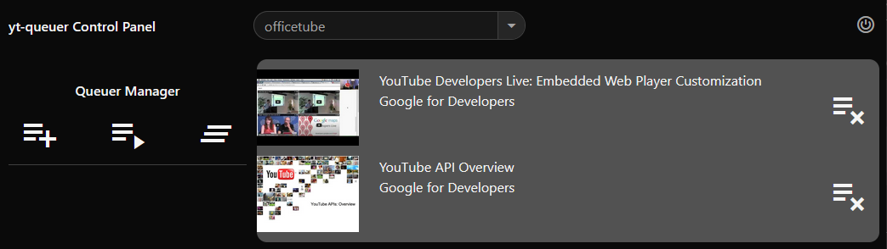

# yt-queuer
Lightweight service and addon to enable queueing and playback of youtube videos on a remote device.

## Planned Features
- Add 'Wake On LAN' for LG WebOS TVs to power button on Controller page. - LOE - Low
- Add controls for playback device (play, pause, seek, next). LOE - Low (figure out callback)
- Allow control of multiple playback devices and queues. LOE - Low (client registration since no hostname in js)
- Create a browser addon as an alternateive to the Controller page. Add options in standard right-click browser menu. LOE - High

## Build
The Makefile build targets will build binary in 'bin/' then copy the binary and any other needed files to 'pkg/'.

Using the default Makefile build target:
```
make build
```
Will build ytqueuer for the architecture you are currently on.

OR

You can specify an architecture.
```
make build GOARCH=amd64
```

OR

Use a predefined build target for a tested architecture.
```
make build-arm64
```
Will build for arm64.

## Deploy
### Copy
Copy pkg/ to the host you want to run it on. Example:
```
rsync -avz pkg/ user@host:ytqueuer
```

### Run
From the host, run ytqueuer via whatever method you prefer.
```
cd ytqueuer
nohup ytqueuer &
```
ytqueuer will listen on all interfaces.

The first time ytqueuer runs it will create a new 'certs' folder with a self generated key and cert if they do not already exist. ytqueuer must use ssl to allow clipboard access in the controller.
```
certs/certificate.crt
certs/privatekey.key
```

## Access
From your preferred browser on the host you want to play videos on, go to:
```
https://localhost:8080
```

If your playback device is different from the device you are running ytqueuer on, replace 'localhost' with a reachable interface on the ytqueuer host.

The browser should load a default video with 'under construction' tape across it if there is nothing in the queue. The first time you load the page you will need to accept the self-signed cert on the warning page (click on Advanced). You will also need to allow Auto Play in the Address Bar. Once Auto Play has been enabled, the playback page should automatically advance to the first video in the queue.

## Control
From a browser on any other device you want to control the queue from, and can reach an interface on the ytqueuer host, go to:
```
https://<ytqueuer-ip>:8080/controller.html
```



If there are any videos in the queue they will be displayed in the middle of the page. On the left you will see icons to:

Add - Add a video to the queue.


Add Next - Add a video to played next in queue.


Clear Queue - Clear the queue. NO CONFIRMATION


When using Add and Add Next you need to have a YouTube video URL copied to your clipboard. When you click on the button you will be prompted to Paste which will take a few seconds to highlight. (this is a Firefox security feature to prevent accidental clicks) The Add and Add Next buttons will take the video URL form your clickboard, get the video id and send it to the API.

To the right of each video in the queue you will see a Remove From Queue button. There is also no confirmation on this button.
